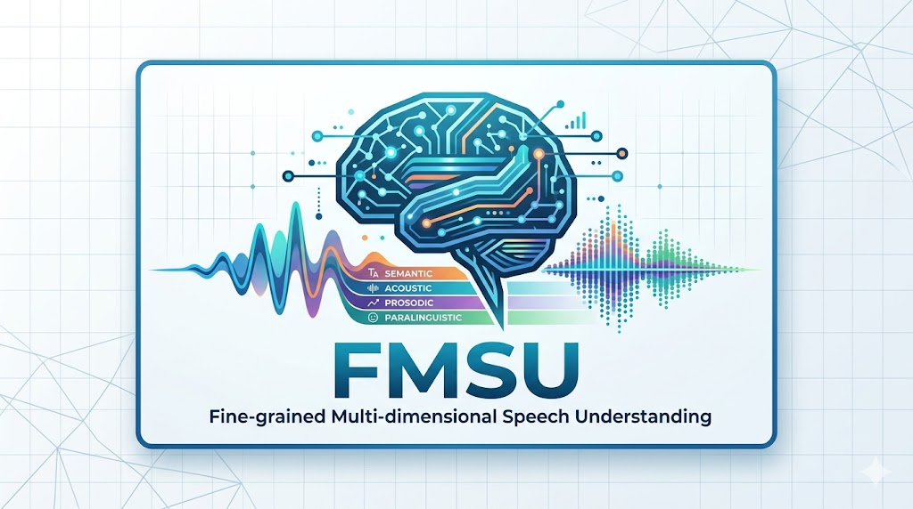
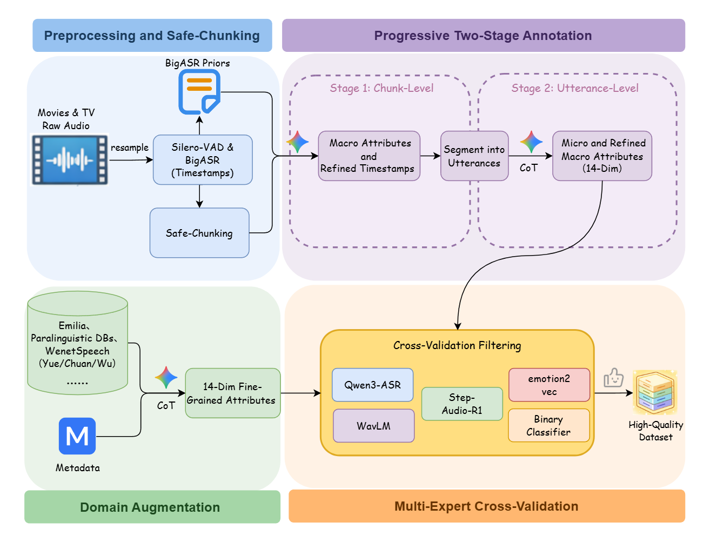
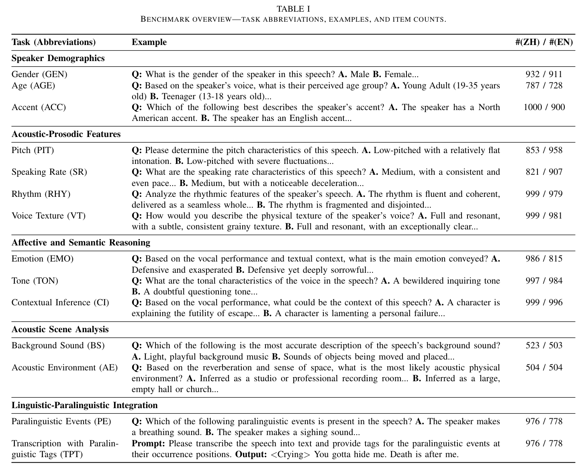
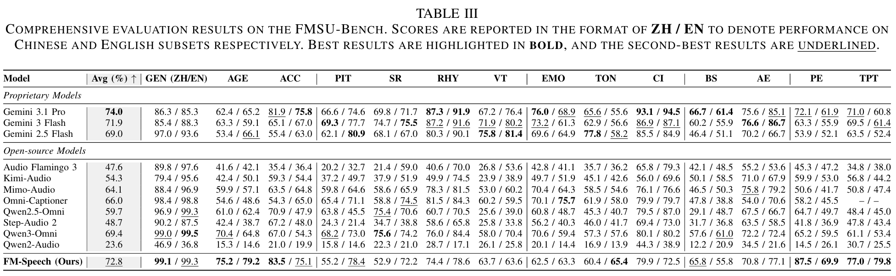

***

# Towards Fine-Grained Multi-Dimensional Speech Understanding: Data Pipeline, Benchmark, and Model

<p align="center">
  Guojian Li<sup>1</sup>, Zhixian Zhao<sup>1</sup>, Zhennan Lin<sup>1</sup>, 
  Jingbin Hu<sup>1</sup>, Qirui Zhan<sup>1</sup>, Yuang Cao<sup>1</sup>, 
  Pengyuan Xie<sup>2</sup>, Chuan Xie<sup>2</sup>, Jie Liu<sup>2</sup>, Qiang Zhang<sup>2</sup>, 
  Zhonghua Fu<sup>1</sup><sup>,╀</sup>, Lei Xie<sup>1</sup><sup>,╀</sup>
</p>

<p align="center">
  <sup>1</sup> Audio, Speech and Language Processing Group (ASLP@NPU), Northwestern Polytechnical University <br>
  <sup>2</sup> Shanghai Lingguang Zhaxian Technology <br>
</p>

<div align="center">

| 📑 [Paper](https://arxiv.org/abs/2605.12036) | 🤖 [FM-Speech Model](https://huggingface.co/ASLP-lab/FM-Speech) | 🌐 [FMSU-Bench](https://huggingface.co/datasets/ASLP-lab/FMSU-Bench) |
|:---:|:---:|:---:|:---:|

</div>

<p align="center">
    <!-- 请在此处替换为你们的 Logo 或项目 Banner -->
    
</p>

## Overview
While speech Large Language Models (LLMs) excel at conventional tasks like basic speech recognition, they lack **fine-grained, multi-dimensional perception**. This deficiency is evident in their struggle to disentangle complex features like micro-acoustic cues, acoustic scenes, and paralinguistic signals. 

To address the challenges of scarce high-quality expressive data, absent fine-grained modeling, and restricted benchmark coverage, we present a holistic framework comprising three pillars: a robust **Data Pipeline**, a pioneering **FMSU-Bench**, and the **FM-Speech Model**.

---

## 1. Data Pipeline
To capture highly expressive spontaneous speech, we develop a robust, LLM-driven data curation pipeline augmented by multi-expert cross-verification. Extracting from in-the-wild audiovisuals (e.g., movies, TV shows), the pipeline effectively resolves complex acoustic environments and long-audio timestamp alignment challenges.
* **Safe-Chunking:** Dynamically segments audio into 5-6 minute windows using Silero-VAD and BigASR to balance temporal hallucinations and context loss.
* **Progressive Two-Stage Annotation:** Leverages Gemini 2.5 Pro via a "macro-to-micro" strategy to extract 14 fine-grained speech attributes.
* **Multi-Expert Cross-Validation:** Utilizes Qwen3-ASR, Emotion2vec, WavLM-based classifiers, and Wav2Vec-BERT to rigorously filter and refine annotations, ensuring high-quality structured data.

<div align="center"></div>

---

## 2. FMSU-Bench
Existing benchmarks predominantly cater to macroscopic tasks and suffer from coarse annotation granularity. We construct **FMSU-Bench**, a pioneering Fine-grained Multi-dimensional Speech Understanding Benchmark.
* **Scale & Scope:** Comprises over **24,000 bilingual instances** (Chinese/English), manually verified by domain experts.
* **Comprehensive Taxonomy:** Systematically covers **14 distinct speech dimensions** structured into a 5-tier taxonomy:
  1. *Speaker Demographics:* Gender, Age, Accent
  2. *Acoustic-Prosodic Features:* Pitch, Speaking Rate, Rhythm, Voice Texture
  3. *Affective and Semantic Reasoning:* Emotion, Tone, Contextual Inference
  4. *Acoustic Scene Analysis:* Background Sound, Acoustic Environment
  5. *Linguistic-Paralinguistic Integration:* Paralinguistic Events, Transcription with Paralinguistic Tags (Evaluated via our novel **PATA** metric).

<div align="center"></div>

## 3. Model: FM-Speech
Leveraging the multi-dimensional fine-grained annotations produced by our pipeline, we introduce **FM-Speech**, built upon the frontier Qwen3-Omni (30B MoE) architecture. 

<div align="center">
  <!-- 请在此处放一张精简的模型输入输出示意图 -->
  <!-- -->
  <p><i>Input: Raw Speech &emsp; ➔ &emsp; Output: 14-Dimension Fine-Grained Speech Attributes (Structured JSON)</i></p>
</div>

To overcome modality gaps and text-conditioned hallucinations, FM-Speech is trained using a **Progressive Curriculum Fine-Tuning** framework, decoupling complex auditory comprehension into three incremental stages: Warm-up (MCQ/QA) $\rightarrow$ Capability Ramp-up $\rightarrow$ Final Alignment (Full JSON).

### 🚀 Usage & Environment Setup

Our model is built upon the Qwen3-Omni architecture. We strongly recommend using **vLLM** for the inference and deployment of FM-Speech. 

**Step 1: Create a fresh Python environment** to avoid runtime conflicts and incompatibilities.
```bash
conda create -n fmspeech python=3.12
conda activate fmspeech
```

**Step 2: Install required packages**
```bash
# Install vLLM (Specifically version 0.13.0)
pip install vllm==0.13.0
# Note: If you meet an "Undefined symbol" error while using VLLM_USE_PRECOMPILED=1, 
# please use "pip install -e . -v" to build vLLM from source.

# Install Transformers and Accelerate
pip install transformers==4.57.3
pip install accelerate

# Install Qwen Omni utilities and Flash Attention
pip install qwen-omni-utils -U
pip install -U flash-attn --no-build-isolation
```

**Step 3: Run Inference**
Prepare a sample audio file and run the inference script to generate the 14-dimension JSON output.
```bash
python infer.py
```
*(See `infer.py` in our repository for detailed loading and inference examples).*

---

## 4. Results
We comprehensively evaluate FM-Speech against 11 advanced speech LLMs (including Qwen3-Omni, Audio Flamingo 3, Gemini 3.1 Pro, etc.) on FMSU-Bench. 

**FM-Speech achieves a state-of-the-art average score of 72.8%** among open-source models, outperforming the original Qwen3-Omni (69.4%) and surpassing proprietary models like Gemini 2.5 Flash and Gemini 3 Flash. It closely approaches the industry-leading Gemini 3.1 Pro (74.0%), demonstrating the immense effectiveness of our data curation and progressive fine-tuning framework.

**Main Results on FMSU-Bench**

<div align="center"></div>

---


## Citation
If you find our data pipeline, benchmark, or model useful for your research, please consider citing our paper:
```bibtex
@misc{li2026finegrainedmultidimensionalspeechunderstanding,
      title={Towards Fine-Grained Multi-Dimensional Speech Understanding: Data Pipeline, Benchmark, and Model}, 
      author={Guojian Li and Zhixian Zhao and Zhennan Lin and Jingbin Hu and Qirui Zhan and Yuang Cao and Pengyuan Xie and Chuan Xie and Jie Liu and Qiang Zhang and Zhonghua Fu and Lei Xie},
      year={2026},
      eprint={2605.12036},
      archivePrefix={arXiv},
      primaryClass={eess.AS},
      url={https://arxiv.org/abs/2605.12036}, 
}
```
